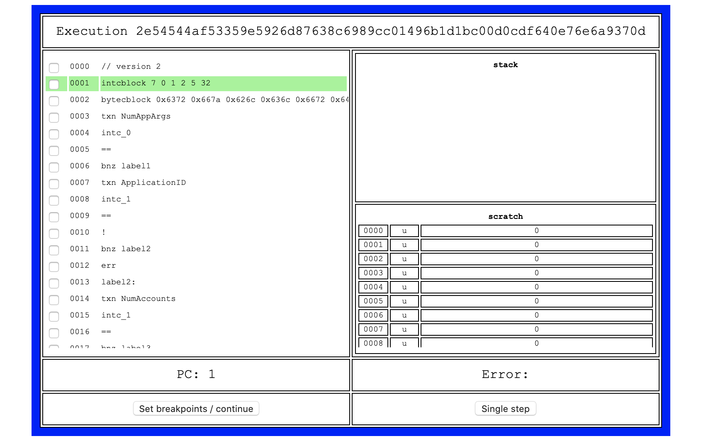

# Algorand TEAL Debugger

- [Algorand TEAL Debugger](#algorand-teal-debugger)
  - [Quick Start](#quick-start)
  - [Features Overview](#features-overview)
    - [Local vs Remote Debugging](#local-vs-remote-debugging)
    - [Frontends](#frontends)
  - [Setting Execution Context](#setting-execution-context)
    - [Protocol](#protocol)
    - [Transaction and Transaction Group](#transaction-and-transaction-group)
    - [Balance records](#balance-records)
    - [Execution mode](#execution-mode)
  - [Chrome DevTools Frontend Features](#chrome-devtools-frontend-features)
    - [Configure the Listener](#configure-the-listener)
    - [Supported Operations](#supported-operations)
  - [Development and Architecture Overview](#development-and-architecture-overview)
    - [TEAL Evaluator](#teal-evaluator)
    - [Tealdbg](#tealdbg)
    - [Debugger Core](#debugger-core)
    - [Debug Adapter](#debug-adapter)
    - [Algod hacking](#algod-hacking)

## Quick Start

1. Run the debugger
    ```
    $ tealdbg debug myprog.teal
    $ tealdbg debug samples/calls_count.teal --balance samples/calls_count_balance.json --txn samples/calls_count_txn.json --proto=future
    $ tealdbg debug samples/calls_count.teal --proto=future --painless
    ```
    It prints out the URL to follow: `devtools://devtools/bundled/js_app.html?...`
2. Open the URL in Google Chrome.
  If you see the `This site can’t be reached` page, open Chrome DevTools [as explained](https://developers.google.com/web/tools/chrome-devtools/open) and refresh the page.

## Features Overview

### Local vs Remote Debugging

The debugger runs either local programs or accept HTTP connections from remote evaluators
configured to run with a remote debugger hook.

Local debugger allows debugging TEAL from files (both sources and compiled) or from transaction(s)
and balance records (see [Setting Execution Context](#setting-execution-context) for details).

Remote debugger might be useful for debugging unit tests for TEAL (currently in Golang only) or for hacking **algod** `eval` and breaking on any TEAL evaluation.
The protocol consist of three REST endpoints and one data structure describing the evaluator state.
See `WebDebuggerHook` and `TestWebDebuggerManual` in [go-algorand sources](https://github.com/algorand/go-algorand/tree/master/data/transactions/logic) for more details.

### Frontends

Two frontends are available:

1. Chrome DevTools (CDT):
    
2. Web page
    

## Setting Execution Context

Local debugger supports setting the execution context: consensus protocol, transaction(s), balance records, execution mode.

### Protocol

Used to determine execution parameters and limits such as TEAL version, max program size and cost and so on.
```
$ tealdbg debug --proto https://github.com/algorandfoundation/specs/tree/e5f565421d720c6f75cdd186f7098495caf9101f
$ tealdbg debug --proto future
```

### Transaction and Transaction Group

Transaction(s) are used for:
1. Providing execution environment for TEAL programs.
    Its fields are accessible by `txn`, `gtxn`, `txna` and `gtxna` instructions.
2. Retrieving TEAL code from `Lsig.Logic` or from `ApplicationCallTx` transactions.

```
$ tealdbg debug --txn samples/txn_group.json
```

If an array of transaction supplied then it is treated as a transaction group. To specify the current transaction for execution use `--group-index` option:

```
$ tealdbg debug --txn samples/txn_group.json --group-index=1
```

Transaction(s) are JSON or MessagePack (`goal clerk` compatible) serialized instances of `transactions`. See [samples dir](https://github.com/algorand/go-algorand/tree/master/cmd/tealdbg/samples) for more examples.

Sample transaction in JSON format:
```json
{
  "sig": "+FQBnfGQMNxzwW85WjpSKfOYoEKqzTChhJ+h2WYEx9C8Zt5THdKvHLd3IkPO/usubboFG/0Wcvb8C5Ps1h+IBQ==",
  "txn": {
    "amt": 1000,
    "close": "IDUTJEUIEVSMXTU4LGTJWZ2UE2E6TIODUKU6UW3FU3UKIQQ77RLUBBBFLA",
    "fee": 1176,
    "fv": 12466,
    "gen": "devnet-v33.0",
    "gh": "JgsgCaCTqIaLeVhyL6XlRu3n7Rfk2FxMeK+wRSaQ7dI=",
    "lv": 13466,
    "note": "6gAVR0Nsv5Y=",
    "rcv": "PNWOET7LLOWMBMLE4KOCELCX6X3D3Q4H2Q4QJASYIEOF7YIPPQBG3YQ5YI",
    "snd": "47YPQTIGQEO7T4Y4RWDYWEKV6RTR2UNBQXBABEEGM72ESWDQNCQ52OPASU",
    "type": "pay"
  }
}
```

### Balance records

Balance records are used for setting environment for stateful TEAL execution and contains data available for TEAL with `balance`, `global Round`, `app_opted_in` and so on instructions.

```
$ tealdbg debug myprog.teal --balance samples/balances.json
```

Balance records are JSON or MessagePack (`goal account dump` compatible) serialized instances of `basics.BalanceRecord`

Sample balance record in JSON format:
```json
{
  "addr": "PNWOET7LLOWMBMLE4KOCELCX6X3D3Q4H2Q4QJASYIEOF7YIPPQBG3YQ5YI",
  "onl": 1,
  "algo": 500000000,
  "asset": {
    "50": {
        "a": 10
    }
  },
  "appl": {
    "100": {
      "hsch": {
        "nbs": 3,
        "nui": 2
      },
      "tkv": {
        "lkeybyte": {
          "tb": "local",
          "tt": 1
        },
        "lkeyint": {
          "tt": 2,
          "ui": 1
        }
      }
    }
  }
}
```

If default/empty local and global state are OK for the application, the use `--painless` CLI option
to automatically create necessary balance records for the application(s) so that `app_` opcodes
do not fail due to absent data in ledger.

### Indexer Support

You can also supply balance records through an indexer https://github.com/algorand/indexer.
Specify the indexer api endpoint, round number at which to fetch balance records, and an api token if necessary.

```
$ tealdbg debug myprog.teal --round roundnumber -i apiendpoint --indexer-token token
```

### Execution mode

Execution mode, either **signature** or **application** matches to **Algod**'s evaluation mode
for logic signature TEAL or application call TEAL. In short, determines either state access allowed or not with state access instructions. For example, `balance`, `global Round`, `app_opted_in` instructions are only available in **application** mode.

```
$ tealdbg debug myprog.teal --mode signature
```

Default value for `--mode` option is **auto** that forces the debugger to scan the program and to guess suitable execution mode.

## Chrome DevTools Frontend Features

### Configure the Listener

Open `chrome://inspect/`, click **Configure**, type `localhost:9392` (default port) and save.
Then active CDT session will appear under "Remote Target" section. Click **inspect** to start debugging.

Refer the screenshot for details:


### Supported Operations

1. **Resume** continues execution until next breakpoint if any.
2. **Step**, **Step Into**, **Step Over** are equivalents.
3. **Step Out** runs the program until the last instruction.
4. **Activate breakpoints** enables or disables all the breakpoints.
5. **Pause on Exceptions** enables breaking on evaluation error.
6. **Scope** pane allows examination of global fields, transaction object(s),
   stack and scratch space. It also shows exception info if any.
7. **Breakpoints** pane shows active breakpoints.
8. **Line numbers** on the right allows breakpoints setting by a mouse-click.


Refer to the [Chrome DevTools debugging](https://developers.google.com/web/tools/chrome-devtools/javascript/reference) documentation for a complete guide.


## Development and Architecture Overview

### TEAL Evaluator

The evaluator accepts a new `Debugger` parameter described as the interface:
```golang
type DebuggerHook interface {
	// Register is fired on program creation
	Register(state *DebugState) error
	// Update is fired on every step
	Update(state *DebugState) error
	// Complete is called when the program exits
	Complete(state *DebugState) error
}
```
If `Debugger` is set the evaluator calls `Register` on creation, `Update` on every step and `Complete` on exit.

### Tealdbg

The debugger consist of a core, transport adapters and debug adapters (frontends).

### Debugger Core

The core process `Register`, `Update` and `Complete` calls from the evaluator.
On `Register` it starts a new session and establish notification channel for state updates.
On `Update` it checks for breakpoints matches and if found, the debugger publishes the notification and waits for confirmation.
On `Complete` it publishes a final state update and removes the session.

### Debug Adapter

An adapter must implement the following interface:
```golang
type DebugAdapter interface {
	SessionStarted(sid string, debugger Control, ch chan Notification)
	SessionEnded(sid string)
	WaitForCompletion()
}
```

The core calls `SessionStarted` for all adapters as part of dispatching `Register`. It is up to adapter to setup communication channel with a user. Then an adapter needs to start processing notifications from the channel and manage execution using debugger's `Control` interface.

The core calls `SessionEnded` on `Complete` call.

`WaitForCompletion` function might or might not be called by integrator (tealdbg). The main purpose is to prevent the main process termination when `evaluation` is done but the user is still working in UI.

### Algod hacking

**WARNING**: Use it only for private network for development purposes.

If one needs to debug TEAL in as much real environment as possible then do

1. Add `WebDebuggerHook` to `data/transactions/logic/eval.go`:
    ```golang
    cx.program = program

    // begin new code
    debugURL := os.Getenv("TEAL_DEBUGGER_URL")
    cx.Debugger = &WebDebuggerHook{URL: debugURL}
    // end new code

    if cx.Debugger != nil {
    ```
2. Start the remote debugger
    ```
    $ tealdbg remote
    ```
3. Rebuild algod
    ```
    $ make install
    ```
4. Set `TEAL_DEBUGGER_URL` to debugger address and restart algod
    ```
    $ export TEAL_DEBUGGER_URL=http://localhost:9392
    $ goal node restart
    ```
