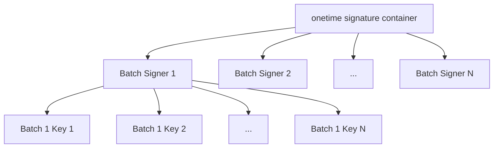

# Participation Key Lifecycle

This document goes into technical details about the lifecycle of participation
keys. Before getting into that let's briefly discuss the purpose of these keys.

## Overview
Participation keys are used to participate in the consensus protocol. Aside
from the registration process, they are completely decoupled from the account
secret key.

Each set of participation keys includes voting keys for each and every round
for their validity range, in addition to state proof secrets for each and every
state proof round (a state proof is not created every round). Because there
are separate keys for each action we sometimes refer to the voting keys as
**OneTimeKeys**. After each key is used, the secret is permanently deleted from
the node. This is a security property that eliminates the possibility of votes
being changed in the event a node becomes compromised at a later date. This
helps ensure finality even if a serious security breach were to occur.

Aside from the **Registration** event, keys are completely decoupled from the
account secrets. This is another security property. A securely managed account
need only be exposed when signing the key registration transaction. For this
reason tools like **algokey** are available for fully offline transaction
signing.

Given a set of participation keys, and a signed key registration transaction,
an algod node can be configured to participate in the consensus protocol.
For each round a single-use key is used to verify the authenticity of messages.

## Key Creation

Keys can be created with **goal** or **algokey**. There are a number of
shortcuts and helpers, especially in **goal**, which won't be covered here.

Required parameters are as follows:
* **First**: the first round the keys will be valid for.
* **Last**: the last round the keys will be valid for.
* **Parent**: The public address of the account that will register the keys.

The parent is stored along with the keys for convenience and error checking.
It is not part of the cryptography. It can technically be set later, but must
be set before the keys can be installed or registered.

There is one optional parameter:
* **Dilution**: Configure the multi-level key storage.

Internally, keys are stored as a two-level hierarchy of ed25519 keys.



The top-level array of keys are used to generate the actual voting keys.
This allows them to be significantly smaller, because voting keys are not
generated until they are required. The **Dilution** parameter defines how many
voting keys are generated for each top-level key. This is done for space
efficiency. It is optional because **sqrt(Last - First)** gives us the most
space efficient value.

Using **algokey** a set of keys can be generated with the command:
```
algokey part generate --first 35000000 --last 36000000 --parent <account-address> --keyfile keys.db
```

This creates a SQLite DB file named **keys.db**. The schema is pretty basic,
consisting of BLOBs for voting keys. State proof keys are also included and are
a bit more involved in their storage pattern.

Similar functionality is built into **goal** along with convenience methods to:
* Generate and install.
* Generate, install and register.
* Lookup account, regenerate, install and register.
* Maybe others, we got carried away.

## Key Installation

The node can only use keys which have been installed, so files like **keys.db**
generated above must be provided to the node. Technically, it's possible for
an account to register a set of keys which are not installed, but this is very
bad. It means the stake calculations are accounting for an account which does
not have a properly configured node.

In older versions of **algod**, keys were installed by dropping the database
file into the data directory. This caused frequent errors with many deployments
because the data directory is often owned by a restricted user and copying the
files around could easily lead to permission errors.

The current version of **algod** supports a series of endpoints on the Admin API
to install and manage keys. One of them is a POST for installation:

```
POST /v2/participation/
```

For example, install the keys generated above to a node located at **localhost:1234** with the following:
```
curl -X POST --data-binary @keys.db -H "Authorization: Bearer admin-token-here" "localhost:1234/v2/participation"
```

**goal** provides a convenience function for this operation:
```
goal account installpartkey --partkey keys.db --delete-input -d /path/to/data-dir
```

Keys should only be installed on a single node. In the event that multiple
nodes have the same set of keys, multiple votes could be cast for a single
account. This could lead to "equivocation" votes, where multiple conflicting
votes are cast for the same account causing both to be ignored.

## Key Storage

Once installed keys are stored in the **Participation Registry**. This is a
service that wraps a SQLite file for storage. Once installed, keys are assigned
an ID, which is referred to as **<participation-ID>** below. The ID is a hash
built from parts of the participation key metadata. There are additional Admin
API endpoints available to manage the registry:

```
DELETE /v2/participation/<participation-id>
GET /v2/participation/
GET /v2/participation/<participation-id>
```

## Key Registration

After installing a key, the account is still considered offline. The network
does not know about the local keys and will not accept votes until the keys are
registered with the network. This is done using a special key registration
transaction.

Like account creation, there are utilities in both **goal** and **algokey**.
For this document we'll use **algokey**. Because it is designed to be used offline
you need to provide the current round.

It has the following arguments:
* **network**: One of devnet, betanet, testnet or mainnet.
* **firstvalid**: The first round where this transaction may be submitted.
* **keyfile**: The keyfile generated earlier. This is used to source most parameters.
* **outputFile**: The unsigned keyreg transaction.

Here is an example call that creates **keyreg.txn**, an unsigned keyreg transaction:
```
algokey part keyreg --network mainnet --firstvalid 31998000 --keyfile keys.db -o keyreg.txn
```

The unsigned transaction can also be signed with **algokey**:
```
algokey sign -t keyreg.txn -o keyreg.stxn -m “[enter your account’s 25 word private key delimited by spaces]”
```

Now copy the signed **keyreg.stxn** file to an node and submit it as usual.
It does not need to be the same node which was used to install the keys.
```
goal clerk rawsend -f keyreg.stxn -d /path/to/data-dir
```

The node monitors blocks for key registrations and updates the **Participation Registry**.

## Voting

The node asks the registry for keys on each round and uses them as needed. At
the end of the round it tells the registry to delete them.

## Participation Registry

The participation registry is optimized in several ways to avoid slowing down
the consensus protocol.

Reads are optimized by caching all keys on startup.

Writes are optimized by putting disk IO in a separate thread. Operations like
deleting old keys (and installing, updating, etc) are performed asynchronously.
The cache is manually updated when async operations are initiated to ensure it
always represents the current state.

# Appendix 1: Key Registration Delay and Overlapping keys

When a key is registered, there is a delay of 320 rounds before it can be used.
The number 320 is defined by the **balanceRound** function, which derives it
from the **SeedRefreshInterval** and **SeedLookback** consensus settings.
This delay is intended to circumvent some specific attacks related to
registering new voting keys at a high frequency. See the research papers for
those details, here we'll focus on some implications of this property.

* When an account is brought online for the first time, it doesn't vote until
  320 rounds after it was registered.
* When an account renews its voting keys by installing a new set of keys and
  registering them, there is a 320 round window where the old keys are still
  used. During this window you must not remove first set of keys from the node
  or else your account will not vote properly.

# Appendix 2: On-chain Storage

When a key registration transaction is evaluated, public keys required to
verify votes from that account are written to the account record. This is the
only on-chain component for voting keys.

Each participating node will accumulate votes and write them to a
**Certificate** which serves to validate the block. The certificate would be
validated using the public keys stored in each account. Because there are many
nodes accumulating votes at the same time, it is possible to have multiple
correct but different certificates validating the same block.
