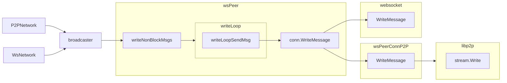

# P2P Network implementation overview

Refer to [p2p sub-package overview](./p2p/README.md) for details about p2p sub-components.

`P2PNetwork` implements the `GossipNode` interface similarly to `WsNetwork`. Both use
the same peer connection management and message broadcast functions but different
transport: lip2p-managed connections and HTTP + WebSocket, respectively.
`P2PNetwork` and `WsNetwork` require `config.NetAddress` to be set in order to start a server.

In addition, `HybridNetwork` is an aggregate of `P2PNetwork` and `WsNetwork` allowing a node
to interact over both networks. In the case of hybrid operation, both `config.P2PNetAddress` and
`config.NetAddress` are used.

## General design

`P2PNetwork` follows the `WsNetwork` approach for peers management and message handling:
  - `msgHandler` used process or route the network protocol messages to external handlers
  (for example, transaction handler or agreement service)
  - `broadcaster` implementing the broadcast functionality (see below)
  - mesh thread to maintain `GossipFanout` number of outgoing peers
  - HTTP Server for external HTTP services (block, catchpoints)
  - `OnNetworkAdvance` listener to react on round advancing

A key difference is that `P2PNetwork` uses `go-libp2p-pubsub` for TX message handling.
Upon start it subscribes to `/algo/tx/0.1.0` topic and publishes TX messages as needed.
The `pubsub` library divides message handling into two stages: validation and processing. Based on
the validation result, a message is either discarded or accepted for further
broadcasting to other peers. This necessitates having separate handlers for TX messages
in `TxHandler`, as we must synchronously determine whether a transaction group is valid:
  - can't ignore fast and broadcast later - will be rejected as a seen message
  - can't accept fast to prevent invalid/expired transactions broadcasting

## Major Components

### HTTP Services

`P2PNetwork` uses libp2p's `http` submodule to handle HTTP traffic over libp2p-managed connection.
It is `http.Handler`-compatible so that service handlers are registered the same way as for `WsNetwork`.

### Phonebook and Peerstore and peer classes

Originally phonebook was designed as an address registry holding permanent (`-p` cli option
or `phonebook.json` extra configuration file) and dynamic (SRV DNS records) entries.
These entries later can be later retrieved by a peer role
(`PhoneBookEntryRelayRole` or `PhoneBookEntryArchivalRole`).
A new `PeerStore` (built on top of `libp2p.Peerstore`) resembles the original `Phonebook`
by strictly implementing some of its methods and has the remaining `Phonebook`'s methods
with a slightly different signature - `string` vs `peer.AddrInfo` for address representation.
The main issue is that entries in `PeerStore` are identified by `PeerID`
and each peer might have multiple addresses (versus the original WS peers with the only one
`host:port` connectivity option.)

Both P2PNetwork and WsNetwork have an extra level of peer classification on top of two phonebook's
classes: `PeersConnectedOut`, `PeersConnectedIn`, `PeersPhonebookRelays`, `PeersPhonebookArchivalNodes`.
This allows network clients to be more precise on peers set they want to work with. For example,
ledger service wants `PeersPhonebookArchivalNodes`, and transaction syncer - `PeersConnectedOut`.

### wsPeer

Peers are created in `wsStreamHandler` that is called for both incoming and outgoing connections
(and streams). `incoming` flag is set to true for incoming connection.
At the very beginning of the `wsStreamHandler` one byte read/write happens in order to make sure:
  - Stream is operable
  - A placeholder for a handshake where some meta-data can be exchanged

Each peer gets a read channel `handler.readBuffer` where it enqueues incoming messages for routing
to appropriate handler.

Connected peers are maintained as a `wsPeers` map similarly to the `WsNetwork`.
The main difference between `P2PNetwork` and `WsNetwork` is `http.Client`. Because wsPeers operate
over the multiplexed streams in libp2p-managed connection, a plain `http.Client` would not be able
to connect to a p2p HTTP server. This requires the `wsPeer` constructed in `P2PNetwork` to have a special
libp2p-streams compatible `http.Client` produced by `MakeHTTPClientWithRateLimit` helper method.
It implements a rate-limiting approach similar to the regular http clients from `WsNetwork`.

### Broadcaster

`msgBroadcaster` encapsulates a shared broadcasting logic: priority vs bulk messages (and queues),
data preparation, peers retrieving. Broadcast requests eventually hits
`peer.writeNonBlockMsgs` -> `peer.writeLoopSendMsg` -> `conn.WriteMessage`.
See the diagram denoting the broadcast data flow.

### DHT and Capabilities discovery

DHT is controlled by the `EnableDHTProviders` configuration option and the capabilities
exposed by a node. These capabilities include:
  - `archival`: a listening node with `Archival` config flag set
  - `catchpointStoring`: a listening node configured to store catchpoints
  - `gossip`: a listening node with `EnableGossipService` config flag set

When the `P2PNetwork` starts, the node begins advertising its capabilities by running
a background goroutine. By default, the underlying DHT implementation pulls bootstrap nodes from
a peer store and attempts to connect immediately, which is not how go-algorand services operate.
To address this, a new `bootstrapper` abstraction has been added to control bootstrap peer
access using the DHT's `BootstrapFunc` mechanism. The callback function returns empty bootstrap
peers until the `P2PNetwork` starts.

### Net identity based peers deduplication

`WsNetwork` net identity was slightly extended to allow ws and p2p nodes cross-check
when running in a hybrid mode:
  - `identityTracker` instance is shared between `WsNetwork` and `P2PNetwork`
  - identity schema supplied to the `WsNetwork` uses a p2p-node private key based message signer
  - `PublicAddress` must be set for hybrid nodes in order to operate properly

Using the changes above `identityTracker` is able to deduplicate `WsNetwork` peer if it ends up
to be hybrid node already connected to via `P2PNetwork` and other way around.
