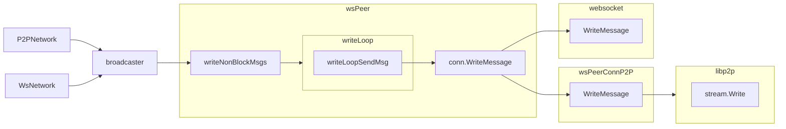

# P2P Network implementation overview

Refer to [p2p sub-package overview](./p2p/README.md) for details about p2p sub-components.

`P2PNetwork` implements the `GossipNode` interface similarly to `WsNetwork`. Both use
the same peer connection management and message broadcast functions but different
transport: lip2p-managed connections and HTTP + WebSocket, respectively.
`P2PNetwork` and `WsNetwork` require `config.NetAddress` to be set in order to start a server.

In addition, `HybridNetwork` is an aggregate of `P2PNetwork` and `WsNetwork` allowing a node
to interact over both networks. In the case of hybrid operation, both `config.P2PNetAddress` and
`config.NetAddress` are used.

## HTTP Services

`P2PNetwork` uses libp2p's `http` submodule to handle HTTP traffic over libp2p-managed connection.
It is `http.Handler`-compatible so that service handlers are registered the same way as for `WsNetwork`.

## Phonebook and Peerstore and peer classes

## wsPeer

Peers are created in `wsStreamHandler` that is called for both incoming and outgoing connections
(and streams). `incoming` flag is set to true for incoming connection.
At the very beginning of the `wsStreamHandler` one byte read/write happens in order to make sure:
  - Stream is operable
  - A placeholder for a handshake where some meta-data can be exchanged

Connected peers are maintained as a `wsPeers` map similarly to the `WsNetwork`.
The main difference between `P2PNetwork` and `WsNetwork` is `http.Client`. Because wsPeers operate
over the multiplexed streams in libp2p-managed connection, a plain `http.Client` would not be able
to connect to p2p HTTP server. This requires `wsPeer` constructed in `P2PNetwork` to have a special
libp2p-streams compatible `http.Client` produced by `MakeHTTPClientWithRateLimit` helper method.
It implement rate-limiting approach similar to the regular http clients from `WsNetwork`.

## Broadcaster

`msgBroadcaster` encapsulates a shared broadcasting logic: priority vs bulk messages (and queues),
data preparation, peers retrieving. Broadcast requests eventually hits
`peer.writeNonBlockMsgs` -> `peer.writeLoopSendMsg` -> `conn.WriteMessage`.
See the diagram denoting the broadcast data flow.

## DHT and Capabilities discovery

## Net identity

<!--
Changes to support P2P
-->