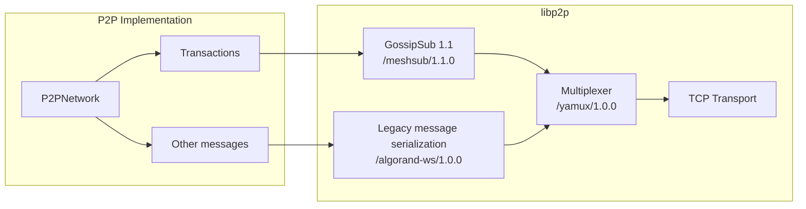

# P2P

This package provides an interface for peer-to-peer networking features, such
as peer identification, addressing, connectivity, messaging, custom protocol streams,
and peer discovery. These features are implemented using [libp2p](https://libp2p.io),
and this package and its sub-packages serve as the main integration point with libp2p.

The code in this package is part of an ongoing initiative to research and implement
an alternative networking stack that supports decentralized network topologies, while
benefiting from the history and experience of libp2p's protocol development.

The current status of this initiative is **purely experimental**, and is not enabled by default
or recommended for regular use. **The components implemented here offer no
guarantee of security, reliability, or performance.** Updates will be provided on the
progress and readiness of these components for standard usage in the future.

## Background

Decentralized networks depend on mechanisms for discovering other peers and reliably
broadcasting messages to other interested peers. Libp2p provides pluggable transports
and multiplexing to allow multiple stream-based protocols to share the same connection.
Libp2p also provides an implementation of a message-based gossip protocol, GossipSub.

Algorand's current network protocol sends messages between peers over bidirectional
WebSocket connections. Nodes that are configured to enable message-forwarding (including
nodes currently called "relays") validate incoming messages, then selectively forward 
messages to other connected peers. This network implementation (`WebsocketNetwork`) sits
behind the `GossipNode` interface in the network package.

## Current P2P implementation details

This package supports a `P2PNetwork` implementation of the `GossipNode` interface,
providing the same peer connection management and message broadcast functions, but
via peer connections managed by libp2p. The `P2PNetwork` implementation uses
[libp2p's multiaddress scheme](https://docs.libp2p.io/concepts/fundamentals/addressing/)
and [peer IDs](https://docs.libp2p.io/concepts/fundamentals/peers/#peer-ids-in-multiaddrs)
to establish connections and identify peers.

Currently transactions (protocol tag `TX`) are distributed using the GossipSub protocol,
while all other messages are forwarded over a custom message protocol `/algorand-ws/1.0.0`
that uses the same message serialization as the existing  `WebsocketNetwork` implementation.
These two protocols are multiplexed over a single connection using libp2p streams.

