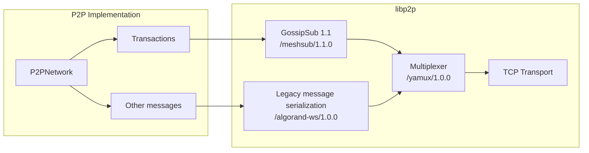
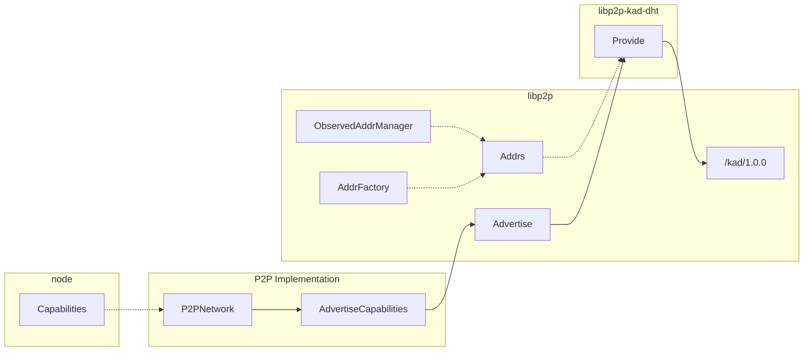

# P2P

This package provides an interface for peer-to-peer networking features, such
as peer identification, addressing, connectivity, messaging, custom protocol streams,
and peer discovery. These features are implemented using [libp2p](https://libp2p.io),
and this package and its sub-packages serve as the main integration point with libp2p.

The code in this package is part of an ongoing initiative to research and implement
an alternative networking stack that supports decentralized network topologies, while
benefiting from the history and experience of libp2p's protocol development.

The current status of this initiative is **purely experimental**, and is not enabled by default
or recommended for regular use. **The components implemented here offer no
guarantee of security, reliability, or performance.** Updates will be provided on the
progress and readiness of these components for standard usage in the future.

## Background

Decentralized networks depend on mechanisms for discovering other peers and reliably
broadcasting messages to other interested peers. Libp2p provides pluggable transports
and multiplexing to allow multiple stream-based protocols to share the same connection.
Libp2p also provides an implementation of a message-based gossip protocol, GossipSub.

Algorand's current network protocol sends messages between peers over bidirectional
WebSocket connections. Nodes that are configured to enable message-forwarding (including
nodes currently called "relays") validate incoming messages, then selectively forward
messages to other connected peers. This network implementation (`WebsocketNetwork`) sits
behind the `GossipNode` interface in the network package.

## Current P2P implementation details

This package supports a `P2PNetwork` implementation of the `GossipNode` interface,
providing the same peer connection management and message broadcast functions, but
via peer connections managed by libp2p. The `P2PNetwork` implementation uses
[libp2p's multiaddress scheme](https://docs.libp2p.io/concepts/fundamentals/addressing/)
and [peer IDs](https://docs.libp2p.io/concepts/fundamentals/peers/#peer-ids-in-multiaddrs)
to establish connections and identify peers.

Currently transactions (protocol tag `TX`) are distributed using the GossipSub protocol (see [pubsub.go](./pubsub.go)),
while all other messages are forwarded over the pre-existing custom message protocol `/algorand-ws/1.0.0` (see [streams.go](./streams.go))
that uses the same message serialization as the existing  `WebsocketNetwork` implementation.
These two protocols are multiplexed over a single connection using libp2p streams.

The underlying libp2p implementation is abstracted as `p2p.Service` and is initialized in two steps:
1. Creating a p2p `Host`
2. Creating a service `serviceImpl` object

`Host` is also used for p2p HTTP server and DHT Discovery service creation. It is also useful for unit testing. Note, `Host` is created with `NoListenAddrs` options that prevents automatic listening and networking until the `Service.Start()` is called. This follows the designs of Algod services (including the WsNetwork service).

### Connection limiting

libp2p's `ResourceManager` is used to limit the number of connections up to `cfg.IncomingConnectionsLimit`.

### DHT and capabilities

Provides helper methods to construct DHT discovery service using `go-libp2p-kad-dht` library.
High level [CapabilitiesDiscovery](./capabilities.go) class supports retrieving (`PeersForCapability`)
peers by a given capability(-ies) or advertising own capabilities (`AdvertiseCapabilities`).

Note, by default private and non-routable addresses are filtered (see `AddrsFactory`),
libp2p's `ObservedAddrManager` can track its own public address and makes it available
(and so that discoverable with DHT) if it was observed at least 4 times in 30 minutes (as of libp2p@v0.33.2).

### HTTP over libp2p connection

libp2p@0.33 added ability to multiplex HTTP traffic in p2p connection.
A custom `/algorand-http/1.0.0` stream is utilized to expose HTTP server and allow
network service clients (catchup, catchpoint, txsync) to register its own handlers
similarly to the legacy ws-net implementation.

### Peerstore

In-memory peerstore implements `libp2p.Peerstore` and go-algorand `Phonebook` interfaces.
Peer classes (relays, archival, etc) and persistent peers (i.e. peers from command line or phonebook.json)
are supported. Possible enhancement is to save/load peerstore to/from disk to tolerate bootstrap nodes failures.

### Logging

lip2p uses zap logger as a separate `ipfs/go-log/v2` module. `EnableP2PLogging` helper adds
go-algorand's `logrus` as a custom zap core so that all libp2p logs go through go-algorand logging facility.
Unfortunately `ipfs/go-log/v2` has a primary logging core as module variable that makes impossible
to have custom `logrus` sub-loggers in unit tests.

### Metrics

`go-libp2p` uses Prometheus as a metrics library, `go-libp2p-kad-dht` relies on OpenCensus library.
go-algorand has two collectors (see `util/metrics`) for both Prometheus and OpenCensus for
counters and gauges with labels. Other types (summary, histogram, distribution) are not supported at the moment.